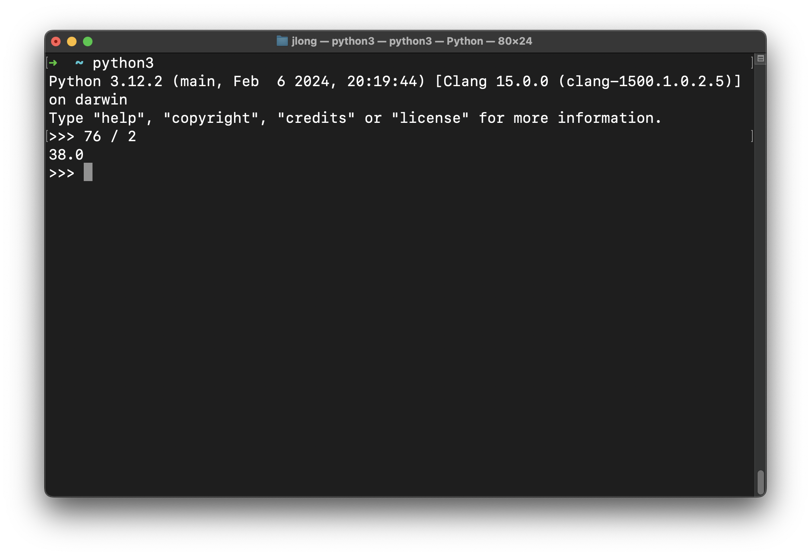
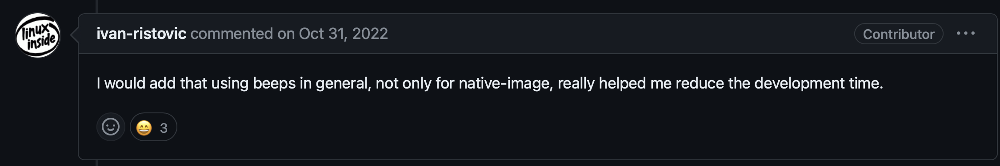
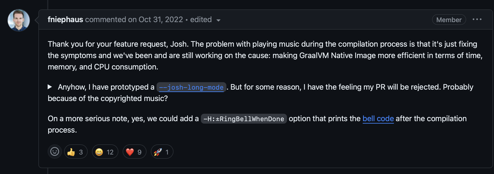

= Bootiful Spring Boot in 2024

:author: Josh Long
:email: josh@joshlong.com

NOTE: the code is https://github.com/joshlong/bootiful-spring-boot-3/tree/main/service[here on my Github account: `github.com/joshlong/bootiful-spring-boot-3`].

Hi, Spring fans! I'm Josh Long, and I work on the Spring team. I'm a Kotlin GDE and a Java Champion, and I'm of the opinion that there's never been a better time to be a Java and Spring Boot developer. I say that fully aware of where we stand in the span of things today. It's been 21+ years since the earliest releases of the Spring Framework and 11+ years since the earliest releases of Spring Boot. This year marks 20 years since the Spring Framework and 10 years since Spring Boot. So, when I say there's never been a better time to be a Java and Spring developer, bear in mind I've been in this for the better part of those decades. I love Java and the JVM,  and I love Spring, and it's been amazing.

But this is the best time. It's never been close. So, let's develop a new application, as always, by visiting my second favorite place on the internet, after production, `start.spring.io`[https://start.spring.io], and we'll see what I mean. Click `Add Dependencies` and choose `Web`, `Spring Data JDBC`, `OpenAI`, `GraalVM Native Support`, `Docker Compose`, `Postgres`, and `Devtools`.

Give it an artifact name. I called my service… "service". I'm great with names. I get that from my dad. My dad was also amazing with names. When I was a small boy, we had a tiny little white dog, and my father named him _White Dog_. He was our family pet for years. But after around ten years, he disappeared. I'm not sure what became of him after all. Maybe he got a job; I don't know. But then miraculously, another small white dog appeared tapping on our home's screen door. So we took him in, and my father named him _Too_. Or _Two_. I don't know. Anyway, _great_ with names. That said, my mom tells me all the time that I'm very lucky she named me... And, yah, that's probably true.

Anyway, choose Java 21. This part is key. You can't use Java 21 if you don't use Java 21. So, you need Java 21. But we are also going to use GraalVM for its native image capabilities.

Don't have Java 21 installed? Download it! Use the fantastic https://sdkman.io[SDKMAN] tool: `sdk install java 21-graalce`. And then make it your default: `sdk default java 21-graalce`. Open a new shell. Download the `.zip` file.

Java 21 is amazing. It's a far sight better than Java 8. It's technically superior in every way. It's faster, more robust, more syntax-rich. It's also morally superior. You won't like the look of shame and disgrace in your children's eyes when they see you're using Java 8 in production. Don't do it. Be the change you want to see in the world. Use Java 21.

You'll get a zip file. Unzip it and open it in your IDE.

I'm using IntelliJ IDEA, and it installs a command-line tool called `idea`.

[source,shell]
----
cd service
idea build.gradlew
# idea pom.xml if you're using Apache Maven
----

If you're using  Visual Studio Code, be sure to install the https://marketplace.visualstudio.com/items?itemName=vmware.vscode-boot-dev-pack[_Spring Boot Extension Pack_] on the _Visual Studio Code Marketplace_.

This  new application is going to be talking to a database; it's a data-centric application. On the _Spring Initializr_, we added support for  PostgreSQL, but now we need to connect to it. The last thing we want is a long `README.md` with a section titled, _A Hundred Easy Steps to Development_. We want to live that _`git clone` &amp; Run_ life!

To that end, the Spring Initializr generated a https://github.com/docker/compose[Docker Compose] `compose.yml` file that contains a definition for Postgres, the amazing SQL database.

.the Docker Compose file, `compose.yaml`
[source,yaml]
----
include::compose.yaml[]
----

Even better, Spring Boot is configured to automatically run the Docker Compose (`docker compose up`) configuration  when the Spring Boot application starts up. No need to configure connectivity details like `spring.datasource.url` and `spring.datasource.password`, etc. It's all done with Spring Boot's amazing  autoconfiguration. Ya love to see it! And, never wanting to leave a mess, Spring Boot will shut down the Docker containers on application shutdown, too.

We want to move as quickly as possible. To that end, we selected DevTools on the _Spring Initializr_. It'll allow us to move quickly. The core conceit here is that restarting Java is pretty slow. Restarting Spring, however, is really quick. So, what if we had a process monitoring our project folder, and that could  take note of newly compiled `.class` files, load them into the classloader, and then create a new Spring `ApplicationContext`, discarding the old one, and giving us the appearance of a live reload? That's exactly what Spring's DevTools do. Run it during development and see your restart time diminish by huge fractions!

This works because, again, Spring is super quick to startup... _Except_, that is, when you are launching a PostgreSQL database on each restart. I love PostgreSQL, but, uh, yeah, it's not meant to be constantly restarted each time you're tweaking method names, modifying HTTP endpoint paths, or finessing some CSS. So, let's configure Spring Boot to simply start the Docker Compose file, and to leave it running instead of restarting each time.

.add the property to `application.properties`
[source,properties]
-----
spring.docker.compose.lifecycle-management=start_only
-----

We'll start with a simple record.

[source,java]
----
include::src/main/java/com/example/service/Customer.java[]
----

I love Java records! And you should too! Don't sleep on records. This innocuous little `record` isn't just a better way to do something like Lombok's `@Data` annotation does, it's actually part of a handful of features that, culminating in Java 21 and taken together, support something called _data-oriented programming_.

Java language architect Brian Goetz talks about this in his https://www.infoq.com/articles/data-oriented-programming-java/[InfoQ article on Data-Oriented Programming] in 2022.

Java has dominated the world of the monolith, the reasoning goes, because of its strong access control, good and quick compiler, privacy protections, and so on. Java makes it easy to create relatively modular, composable, monolithic applications. Monolithic applications are typically large, sprawling codebases, and Java supports it. Indeed, if you want modularity and want to structure your large monolithic codebase well, check out the https://spring.io/projects/spring-modulith[Spring Modulith] project.

But things have changed. These days, the vector by which we express change in a system these days is _not_ the specialized implementations of deep-seated hierarchies of abstract types (through dynamic dispatch and polymorphism), but instead in terms of the often ad-hoc messages that get sent across the wire, via HTTP/REST, gRPC, messaging substrates like Apache Kafka and RabbitMQ, etc. It's the data, dummy!

Java has evolved to support these new patterns. Let's take a look at four key features - records, pattern matching, smart switch expressions, and sealed types - to see what I mean. Suppose we work in a heavily regulated industry, like finance.

Imagine we have an interface called `Loan`. Obviously, loans are heavily regulated financial instruments. We don't want somebody coming along and adding an anonymous inner class implementation of the `Loan` interface, sidestepping the validation and protection we've worked so earnestly to build into the system.

So, we'll use `sealed` types. Sealed types are a new sort of access control or visibility modifier.

[source,java]
----
include::src/main/java/com/example/service/Loan.java[]
----

In the example, we're explicitly stipulating that there are two implementations of `Loan` in the system: `SecuredLoan` and `UnsecuredLoan`. Classes are open for subclassing by default, which violates the guarantees implied by a sealed hierarchy. So, we explicitly make the `SecuredLoan` `final`. The `UnsecuredLoan` is implemented as a record, and is implicitly final.

Records are Java's answer to tuples. They are tuples. It's just that Java is a nominal language: *things have names*. This tuple has a name, too: `UnsecuredLoan`.  Records give us a lot of power if we agree to the contract they imply. The core conceit of records is that the identity of the object is equal to the identity of the fields, they're called 'components', in a record. So in this case, the identity of the record is equal to the identity of the `interest` variable. If we agree to that, then the compiler can give us a constructor, it can give us storage for each of the components, it can give us a `toString` method, a `hashCode` method, and an `equals` method. And it'll give us accessors for the components in the constructor. Nice! _And_, it supports destructuring! The language knows how to extract out the state for the record.

Now, let's say I wanted to display a message for each type of `Loan`. I'll code up a method. Here's the naïve first implementation.

[source,java]
----

	@Deprecated
	String badDisplayMessageFor(Loan loan) {
		var message = "";
		if (loan instanceof SecuredLoan) {
			message = "good job! ";
		}
		if (loan instanceof UnsecuredLoan) {
			var usl = (UnsecuredLoan) loan;
			message = "ouch! that " + usl.interest() + "% interest rate is going to hurt!";
		}
		return message;
	}

----

This works, sort of. But it's not carrying its weight.

We can clean it up. Let's take advantage of pattern matching, like this:

[source,java]
-----

	@Deprecated
	String notGreatDisplayMessageFor(Loan loan) {
		var message = "";
		if (loan instanceof SecuredLoan) {
			message = "good job! ";
		}
		if (loan instanceof UnsecuredLoan usl) {
			message = "ouch! that " + usl.interest() + "% interest rate is going to hurt!";
		}
		return message;
	}

-----

Better. Note that we're using pattern matching to match the shape of the object and then extract the definitively cast-able thing into a variable, `usl`. We don't even really need the `usl` variable, though, do we. Instead, we want to dereference the `interest` variable. So we can change the pattern matching to extract that variable, like this.

[source,java]
-----

	@Deprecated
	String notGreatDisplayMessageFor(Loan loan) {
		var message = "";
		if (loan instanceof SecuredLoan) {
			message = "good job! ";
		}
		if (loan instanceof UnsecuredLoan(var interest) ) {
			message = "ouch! that " + interest + "% interest rate is going to hurt!";
		}
		return message;
	}

-----

What happens if I comment out one of the branches? Nothing! The compiler doesn't care.  We're not handling one of the critical paths through which this code could pass.

Likewise, I have this value stored in a variable, `message`, and I'm assigning it as a side effect of some condition. Wouldn't it be nice if I could cut out the intermediate value and just return some expression? Let's look at a cleaner implementation using smart switch expressions, another nifty novelty in Java.

[source,java]
----
	String displayMessageFor(Loan loan) {
		return switch (loan) {
			case SecuredLoan sl -> "good job! ";
			case UnsecuredLoan(var interest) -> "ouch! that " + interest + "% interest rate is going to hurt!";
		};
	}
----

This version uses smart switch expressions to return a value and pattern matching. If you comment out one of the branches, the compiler will bark, because - thanks to sealed types - it knows that you haven't exhausted all possible options. Nice! The compiler is doing a lot of work for us! The result is both cleaner and more expressive. Mostly.

So, back to our regularly scheduled programming.  Add an interface for the Spring Data JDBC repository and a Spring MVC controller class. Then start the application up. Notice that this takes an exceedingly long period of time! That's because behind the scenes, it's using the Docker daemon to start up the PostgreSQL instance.

But henceforth, we're going to use Spring Boot's  `DevTools`. You only need to recompile. If the app is running, and you're using Eclipse or Visual Studio Code, you will only need to save the file: CMD+S on a macOS. IntelliJ IDEA doesn't have a `Save` option; force a build with CMD+Shift+F9 on macOS. Nice.

Alright, we've got our HTTP web endpoint babysitting a database, but there's nothing in the database, so this will fail, surely. Let's initialize our database with some schema and some sample data.

Add `schema.sql` and `data.sql`.

.the DDL for our application, `schema.sql`
[source,java]
----
include::src/main/resources/schema.sql[]
----

.some sample data for the application, `data.sql`
[source,java]
----
include::src/main/resources/data.sql[]
----

Make sure to tell Spring Boot to run the SQL files on startup by adding the following property to `application.properties`:

[source,properties]
----
spring.sql.init.mode=always
----

Reload the application: CMD+Shift+F9, on macOS. On my computer, that reload is about 1/3rd the time, or 66% less, than it takes to restart both the JVM and the application itself. Huge.

It's up and running. Visit `http://localhost:8080/customers` to see the results. It worked! Of course, it worked. It was a demo. It was always going to work.

This is all pretty stock standard stuff. You could've done something similar ten years ago. Mind you, the code would've been far more verbose. Java's improved by leaps and bounds since then. And of course, the speeds wouldn't have been comparable. And of course, the abstractions are better now. But you could've done something similar - a web application babysitting a database.

Things change. There are always new frontiers. Right now, the new frontier is *Artificial Intelligence*, or AI. AI: because the search for good ol' *Intelligence* clearly wasn't hard enough.

AI is a huge industry, but what most people mean when they think of AI is _leveraging_ AI. You don't need to use Python to use Large Language Models (LLMs), in the same way that most folks don't need to use C to use SQL databases. You just need to integrate with the LLMs, and here Java is second to none for choice and power.

At our last tentpole  https://springone.io/history-of-spring[SpringOne] developer event, in 2023, we announced https://spring.io/projects/spring-ai[**Spring AI**], a new project that aims to make integrating and working with AI as easy as possible.

You'll want to ingest data, say from an account, files, services, or even a set of PDFs. You'll want to store them for easy retrieval in a vector database to support similarity searches. And you'll want to then integrate with an LLM, giving it data from that vector database.

Sure, there are client bindings for any of the LLMs that you could possibly want - https://docs.aws.amazon.com/bedrock/[Amazon Bedrock], https://azure.microsoft.com/en-us/products/ai-services/openai-service[Azure OpenAI], https://cloud.google.com/vertex-ai/docs/reference/rest[Google Vertex] _and_ https://ai.google.dev/docs/gemini_api_overview[Google Gemini], https://ollama.com[Ollama], https://huggingface.co[HuggingFace], and of course https://openai.com[OpenAI] itself, but that's _just the beginning_.

All the knowledge that powers an LLM is baked into a model, and that model then informs the LLM's understanding of the world. But that model has an expiry date, of sorts, after which its knowledge is stale. If the model was built two weeks ago it won't know about something that happened yesterday. So if you want to build, say, an automated assistant that fields requests from users about their bank accounts, then that LLM is going to need to be apprised of the up-to-date state of the world when it does so.

You can add information in the request that you make and use it as context to inform the response. If it were only this simple, then that wouldn't be so bad. There's another wrinkle. Different LLMs support different _token window sizes_. The token window determines how much data can you send and receive for a given request. The smaller the window, the less information you can send, and the less informed the LLM will be in its response.

One thing you might do here is to put the data in a vector store, like https://github.com/pgvector/pgvector[pgvector], https://neo4j.org[Neo4j],  http://weaviate.io[Weaviate], or otherwise, and then connect your LLM to that vector database. Vector stores give you the ability to, given a word or sets of words, find other things that are similar to them. It stores data as mathematical representations and lets you query for similar things.

This whole process of ingesting, enriching, analyzing and digesting data to inform the response from an LLM is called *Retrieval Augmented Generation* (RAG), Spring AI supports all of it. For more, see this https://www.youtube.com/watch?v=aNKDoiOUo9M[Spring Tips video I did on Spring AI].  We're not going to leverage all these capabilities here, however. Just one.

We added `OpenAI` support on the Spring Initializr so Spring AI is already on the classpath. Add a new controller, like this:

.an AI-powered Spring MVC controller
[source,java]
----
include::src/main/java/com/example/service/StoryController.java[]
----

Pretty straightforward! Inject Spring AI's `ChatClient`, use it to send a request to the LLM, get the response, and return it as JSON to the HTTP client.

You'll need to configure your connection to OpenAI's API with a property, `spring.ai.openai.api-key=`. I exported it as an environment variable, `SPRING_AI_OPENAI_API_KEY`, before I ran the program. I won't reproduce my key here. Forgive me for not leaking my API credential.

CMD+Shift+F9 to reload the application, and then visit the endpoint: `http://localhost:8080/story`. The LLM might take a few seconds to produce a response, so get that cup of coffee, glass of water, or whatever, ready for a quick but satisfying sip.

.the JSON response in my browser, with a JSON formatter plugin enabled
image::images/story-time-ai-response.png[]

There it is! We live in an age of miracles! The age of the freaking singularity! You can do anything now.

But it did take a few seconds, didn't it? I don't begrudge the computer that time! It did a splendid job! I couldn't do that any faster. Just look at the story it generated! It's a work of art.

But it did take a while. And that has scalability implications for our applications. Behind the scenes when we make a call to our LLM, we're making a network call. Somewhere, deep in the bowels of the code, there's a `java.net.Socket` from which we've obtained a  `java.io.InputStream` that represents the `byte[]` data coming from the service. I don't know if you remember using `InputStream` directly. Here's an example:

// :: show a while loop reading from an InputStream one byte at a time::
[source,java]
----
    try (var is = new FileInputStream("afile.txt")) {
        var next = -1;
        while ((next = is.read()) != -1) {
            next = is.read();
            // do something with read
        }
    }
----

See that part where we read bytes in from the `InputStream` by calling `InputStream.read`? We call that a *blocking operation*. If we call `InputStream.read` on line four, then we must wait until the call returns until we can get to line five.

What if the service to which we're connecting   simply returns too much data? What if the service is down? What if it never returns? What if we're stuck, waiting, in perpetuity? _What if_?

This is _tedious_ if it only happens once. But it's an existential threat for our services if it can happen on every thread in the system used to handle HTTP requests. This happens a lot. It's the reason why it's possible to log in to an otherwise unresponsive HTTP service and find that the CPU is basically asleep - idle! - doing absolutely nothing or little at all. All the threads in the thread pool are stuck in a wait state waiting for something that's not coming.

This is a huge waste of the valuable CPUs capacity we have paid for. And the best-case scenario is still not good. Even if the method will eventually return, it still means that the thread on which that request is being handled is unavailable to anything else in the system. The method is monopolizing that thread so nobody else in the system can use it. This wouldn't be an issue if threads were cheap and abundant. But they're not. For most of Java's lifetime, each new thread was paired one to one with an operating system thread. And it was not cheap. There's a certain amount of bookkeeping associated with each thread. One to two megabytes. So you won't be able to create many threads, and you're wasting what few threads you do have. The horror! Who needs sleep anyway?

There's got to be a better way.

You can use non-blocking IO. Things like the hemorrhoid-inducing and complex Java NIO library. This is an option, in the same way that living with a family of skunks is an option: it stinks! Most of us don't think in terms of non-blocking IO, or regular IO, anyway. We live at higher rungs on the abstraction ladder.  We could use reactive programming. I _love_ reactive programming. I even wrote a book about it - _Reactive Spring_[https://reactivespring.io]. But it's not exactly obvious how to make that work if you're not used to thinking like a functional programmer. It's a different paradigm and implies a rewrite of your code.

What if we could have our non-blocking cake and eat it too? With https://openjdk.org[Java 21], now we can! There's a new feature called virtual threads that makes this stuff a ton easier! If you do something blocking on one of these new _virtual threads_, the runtime will detect that you're doing a blocking thing - like `java.io.InputStream.read`, `java.io.OutputStream.write`, and `java.lang.Thread.sleep` - and move that blocking, idle activity off of the thread and into RAM. Then, it'll basically set an egg timer for sleep, or monitor the file descriptor for IO, and let the runtime repurpose the thread for something else in the meantime. When the blocking action has finished, the runtime moves it back onto a thread and lets it continue from where it started, all with almost no changes to your code. It's hard to understand, so let's look at it by way of an example. I  shamelessly  _borrowed_ this example  from Oracle Developer Advocate https://twitter.com/josepaumard[José Paumard].

.this example demonstrates creating 1,000 threads and sleeping for 400 milliseconds on each one, while noting the name of the first of those 1,000 threads.
[source,java]
----
include::src/main/java/com/example/service/Threads.java[]
----

We're using the `Thread.ofPlatform` factory method to create regular  ol' platform threads, identical in nature to the threads we've created basically since Java's debut in the 1990's. The program creates 1,000 threads. In each thread, we sleep for 100 milliseconds, four times. In between, we test if we're on the first of the 1000 threads, and if we are, we note the current thread's name by adding it to a set. A set dedupes its elements; if the same name appears more than once, there'll still only be one element in the set.

Run the program (CMD+Shift+F9!) and you'll see that the physics of the program are unchanged. There is only one name in the `Set<String>`. Why wouldn't there be? We only tested the same thread, over and over.

Now, change that constructor to use _virtual threads_: `Thread.ofVirtual`. Super easy change. And now run the program.  CMD+Shift+F9.

You'll see that there is more than one element in the set. You didn't change the core logic of your code at all. And indeed you only even had to change _one_ thing, but now, seamlessly, behind the scenes, the compiler and the runtime rewrote your code so that when something blocking   happens on a virtual thread, the runtime seamlessly takes you off and puts you back on threads after the blocking thing has concluded. This means that the thread on which you existed before is now available to other parts of the system. Your scalability is going to go through the roof!

And you might protest, well I don't want to have to change all my code. First, that's a ridiculous argument, the change is trivial. You might protest: I don't want to be in the business of creating threads, either. Good point. Tony Hoare, in the 1970's, wrote that `NULL` is the 1 billion dollar mistake. He was wrong. It was, in fact, PHP. But, he also spoke at length about how untenable it was to build systems using threading. You're going to want to work with higher order abstractions, like sagas, actors, or at the very least an `ExecutorService`.

And there's a new virtual thread executor as well: `Executors.newVirtualThreadPerTaskExecutor`. Nice! If you're using Spring Boot, it's trivial to override the default bean of that type for use in parts of the system. Spring Boot will pull that in and defer to it instead. Easy enough. But if you're using Spring Boot 3.2 You are, surely, using Spring Boot 3.2, right? You realize that each release is only support for like a year, right? Make sure to check out an given https://spring.io/projects/spring-boot#support[Spring projects' support policy]. If you are using 3.2,  then you need only add one property to `application.properties` and we'll plugin the virtual thread support for you.

[source,properties]
----
spring.threads.virtual.enabled=true
----

Nice! No code changes required. And now you should see much improved scalability, and might be able to scale down some of the instances in your load balancer, if your services are IO bound. My suggestion? Tell your boss you're gonna save the company a ton of cash but insist you want that money in your paycheck. Then deploy this change. Voilà!

Alright, we're moving quickly. We've got `git clone` &amp; run-ability. We've got Docker compose support. We've got DevTools. We have a very nice language and syntax. We've got the freaking singularity. We're moving quickly. We've got scalability. Add the Spring Boot Actuator to the build and now you've got observability. I think it's time we turned to production.

I wanna package this application up and make it as efficient as possible. Here, my friends, there are a couple of things we need to consider. First of all, how do we containerize the application? Simple. Use https://buildpacks.io[Buildpacks]. Easy. Remember, friends don't let friends write Dockerfiles. Use Buildpacks. They're supported out of the box with Spring Boot, too: `./gradlew buildBootImage` or `./mvnw spring-boot:build-image`. This isn't new though, so next question.

How do we get this thing to be as efficient and optimized as possible? And before we dive into this, my friends, it's important to remember that Java is already very very very efficient. I love https://thenewstack.io/which-programming-languages-use-the-least-electricity/[this blog] from 2018, before the COVID pandemic, or _BC_.

It looks at which languages use the least energy, or are the most energy-efficient. C is the most energy-efficient. It uses the least electricity. 1.0. It's the baseline. It's efficient... for *MACHINES*. Not people! Definitely, _not_  people.

Then we have Rust and its zero-cost abstractions. Well done.

Then we have C++...

ifdef::backend-pdf[]

endif::[]

ifndef::backend-pdf[]
image::images/gross.gif[]
endif::[]

C++ is disgusting! Moving on...

Then we have the Ada language, but.. who cares?

And then we have Java, which is nearly 2.0. Let's just round up and say 2.0. Java is two times - twice! - as inefficient as C. Or one half  as efficient as C.

So far so good? Great. It's in the top 5 most efficient languages, though!

If you scroll the list, you'll see some amazing numbers. Go and C# coming in around the 3.0+ range. Scroll down here, and we have JavaScript and TypeScript, one of which - to my endless bafflement - is four times _less_ efficient than the other!

Then we have PHP and Hack, the less said about which the better. Moving on!

Then we have JRuby and Ruby. Friends, remember https://www.jruby.org[JRuby] is https://www.ruby-lang.org/en/[Ru[by], written in Java. And Ruby is Ruby, written in C. And yet JRuby is almost a one third more efficient than Ruby! Just by dint of having been written in Java, and running on the JVM. The JVM is an amazing piece of kit. Absolutely phenomenal.

Then.. we have Python. And this, well this makes me very sad indeed! I _love_ Python! I've been using Python since the 1990's! Bill Clinton was president when I first learned Python! But these numbers are _not_ great. Think about it. 75.88. Let's round up to 76. I'm not great at math. But you know what is? Freakin' Python! Let's ask it.

38! That means that if you ran a program in Java, and the generation of the energy required to run it creates a bit of carbon that ends up  trapped in the atmosphere, raising the temperature, and that heightened temperature in turn kills ONE tree, then the equivalent program in Python would kill THIRTY-EIGHT trees! That's a forest! That's worse than Bitcoin! We need to do something about this, and soon. I don't know what, but something.

Anyway, what I'm trying to say is that Java is already _amazing_. I think this is because of two things that people take for granted: garbage collection and the Just In Time (JIT) compiler.

Garbage collection, well we all know what it is. Heck, https://www.whitehouse.gov/wp-content/uploads/2024/02/Final-ONCD-Technical-Report.pdf[even the White House appreciates garbage-collected, memory-safe languages] like Java in its recent report on securing software to secure the building blocks of cyberspace.

The Java programming language garbage collector lets us write mediocre software and sort of _get away_ with it. It's dope! That said, I do take issue with the notion that it is the _original_ Java garbage collector! That honor belongs elsewhere, like perhaps https://twitter.com/jtannady/status/981547257479778307?lang=en[with Jesslyn].

And the JIT is another amazing piece of kit. It analyses frequently accessed code paths in your application and turns them into operating system and architecture-specific native code. It can only do this for some of your code though. It needs to know that the types that are in play when you compile the code are the only types that will be in play when you run the code. And some things in Java - a very dynamic language with a runtime that's more akin to that of JavaScript, Ruby, and Python - allow Java programs to do things that would violate this constraint. Things like serialization, JNI, reflection, resource loading, and JDK proxies. Remember, it's possible, with Java, to have a `String` that has as its contents a Java source code file, compile that string into a `.class` file on the filesystem, load the `.class` file into the `ClassLoader`, reflectively create an instance of that class, and then - if that class is an interface - to create a JDK proxy of that class. And if that class implements `java.io.Serializable`, it's possible to write that class instance over a network socket and load it on another JVM.  And you can do all  of that without ever having an explicit typed reference to anything beyond `java.lang.Object`! It's an amazing language, and this dynamic nature makes it a very productive language. It also frustrates the JIT's attempt at optimizations.

Still, the JIT does an amazing job where it can. And the results speak for themselves. So, one wonders: why couldn't we proactively JIT the whole program? Ahead of time? And we can. There's an OpenJDK distribution called https://graalvm.org[GraalVM] that has a number of niceties that extend the OpenJDK release with extra tools like the `native-image` compiler. The native image compiler is dope. But this native image compiler has the same constraints. It can't do its magic for very dynamic things. Which is a problem. As most code - your unit testing libraries, your web frameworks, your ORMs, your logging libraries… everything! - use one or all of those dynamic behaviors.

There is an escape hatch. You can furnish configuration in the form of `.json` files to the GraalVM compiler in a well-known directory: `src/main/resources/META-INF/native-image/$groupId/$artifactId/\*.json`. These `.json` files have two problems.

First, the word "JSON" sounds stupid. I don't like saying the word "JAY-SAWN". As an adult, I can't believe we say these things to each other. I speak French, and in French, you'd pronounce it _jeeesã_. So, `.gison`. Much nicer. The Hokkien language has a word - _gingsong_ (happiness), which also could work. So you could have .gingsong. Pick your team! Either way,  `.json` should not stand. I'm team `.gison`, but it doesn't matter.

The second problem is that, well, there's just so much darned of it that's required! Again, just think about all the places where your programs do these fun, dynamic things like  reflection, serialization, JDK proxies, resource loading, and JNI! It's endless. Your web frameworks. Your testing libraries. Your data access technologies. I don't have time to write artisanal, handcrafted configuration files for every program. I don't even have enough time to finish this blog!

So, instead, we'll use the Spring Boot  ahead-of-time (AOT) engine introduced in 3.0. The AOT engine analyses the beans in your Spring application and emits the requisite  configuration files for you. Nice! There's even a whole component model that you can use that extends Spring to compile time. I won't get into all of that here, but you can read my https://tanzu.vmware.com/content/white-papers/spring-boot-3[free e-book] or watch my free YouTube video introducing all things   https://www.youtube.com/watch?v=TOfYlLjXufw[Spring and AOT]. It's basically the same content, just different ways to consume it.

So let's kick off that build with Gradle, `./gradlew nativeCompile`, or `./mvnw -Pnative native:compile` if you're using Apache Maven. You might want to skip tests on this one... This build will take a little while. Remember, it's doing an analysis of everything in your codebase - be it the libraries on the classpath, the JRE, and the classes in your code itself - to determine which types it should preserve and which it should throw out. The result is a lean, mean, lightning-fast runtime machine, but at the cost of a very, _very_ slow compilation time.

It takes so long, in fact, that it kinda just gums up my flow. It stops me dead in my tracks, waiting. I am like the platform threads from earlier on, in this very blog: _blocked_! I get bored. Waiting. Waiting. I now finally understand this https://xkcd.com/303/[famous XKCD cartoon].

Sometimes I start to hum music. Or theme songs. Or elevator music. You know what https://en.wikipedia.org/wiki/Elevator_music[elevator music] sounds like, right? Ceaseless, endless. So, I thought, wouldn't it be great if everyone heard elevator music, as well?  https://github.com/oracle/graal/issues/5327[So I asked].  I got some great responses.

One suggested, from our friend  that we should play this elevator music from the soundtrack to the Nintendo 64 video game to the first Pierce Brosnan outing as James Bond, _Goldeneye_. I like it.

._Goldeneye_ had some amazing elevator music!
image::images/adinn-elevator-music.png[]

One response suggested that having a beeping sound would be useful. Couldn't agree more. My stupid microwave will make a _ding!_ sound when it's done. Why couldn't my multi-million line compiler?

._DING!_

And then we got this response, from another one of my favorite doctors, https://twitter.com/fniephaus[Dr. Niephaus], who works on the GraalVM team. He said that adding elevator music would only just fix the symptoms, and not the cause of the problem, which is making GraalVM even more efficient in terms of time and memory.

Ok. But he did share this promising prototype!

image::images/graalvm-prototype.png[]

I'm sure it'll get merged any day now...

Anyway! If you check the compilation, it should be done now. It's in the `./build/native/nativeCompile/` folder, and it's called `service`. On my machine, the compilation took 52 seconds. Yeesh!

Run it. It'll fail because, again, we're living that `git clone` &amp; run lifestyle! We didn't specify any connectivity credentials! So, run it with   environment variables specifying your SQL database connectivity details. Here's the script I used on my Machine. This will work only on a Unix-flavored operating system, and works for either Maven or Gradle.

[source,shell]
----
#!/usr/bin/env bash

export SPRING_DATASOURCE_URL=jdbc:postgresql://localhost/mydatabase
export SPRING_DATASOURCE_PASSWORD=secret
export SPRING_DATASOURCE_USERNAME=myuser

SERVICE=.
MVN=$SERVICE/target/service
GRADLE=$SERVICE/build/native/nativeCompile/service
ls -la $GRADLE && $GRADLE || $MVN

----

On my machine, it starts up in ~100 milliseconds! Like a rocket! But I don't really care all that much about that because this is a standalone, long-lived service. What I care about is the https://en.wikipedia.org/wiki/RSS[Resident Set Size (RSS)]. Note the process identifier (PID) - it'll be in the logs. If the PID is 55, then get the RSS like this using the `ps` utility, available on virtually all Unixes:

[source,shell]
----
ps -o rss 55
----

It'll dump out a number in kilobytes, so divide by a thousand, and you'll get the number in megabytes. On my machine, it takes just over 100MB to run. You can't run Slack in that tiny amount of RAM. I bet you've got individual browser tabs in Chrome taking that much.

So, we have a program that is as concise as can be while being easy to develop and iterate on. And it uses virtual threads to give us unparalleled scalability. It runs as a standalone, self-contained, operating system and architecture-specific native image. Oh! And, it supports the freaking singularity!

We live in an amazing time. There's never been a better time to be a Java and Spring developer. I hope I've so persuaded you, too.

If you enjoyed this blog, I hope you'll subscribe to our https://youtube.com/@springsourcedev[YouTube channel], where I have new videos every week on the https://bit.ly/spring-tips-playlist[_Spring Tips_]. And, of course, you can find my https://biodrop.io/joshlong[Twitter/X, website, YouTube channel, books, Podcast, and much more here on Biodrop]. Thank you!